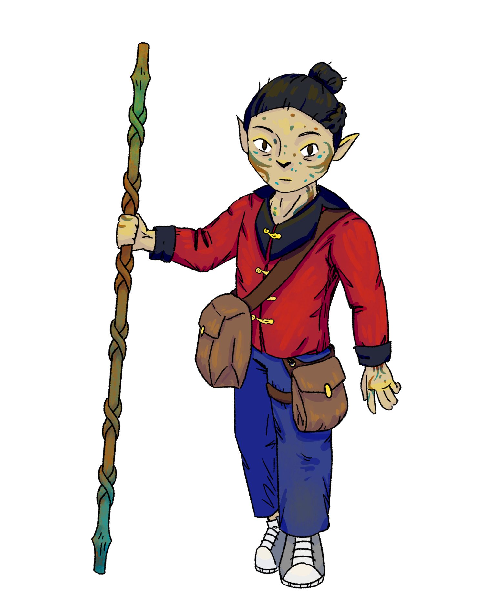
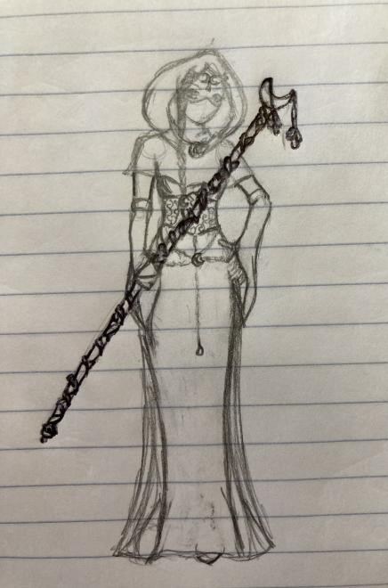
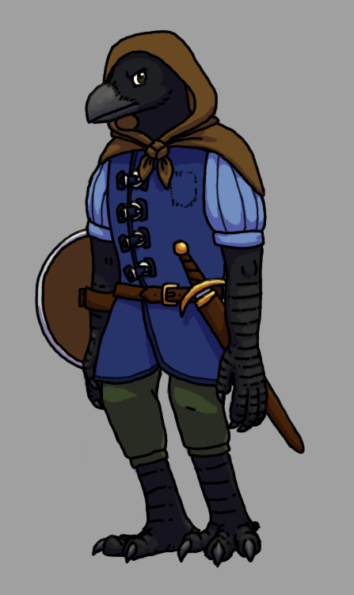
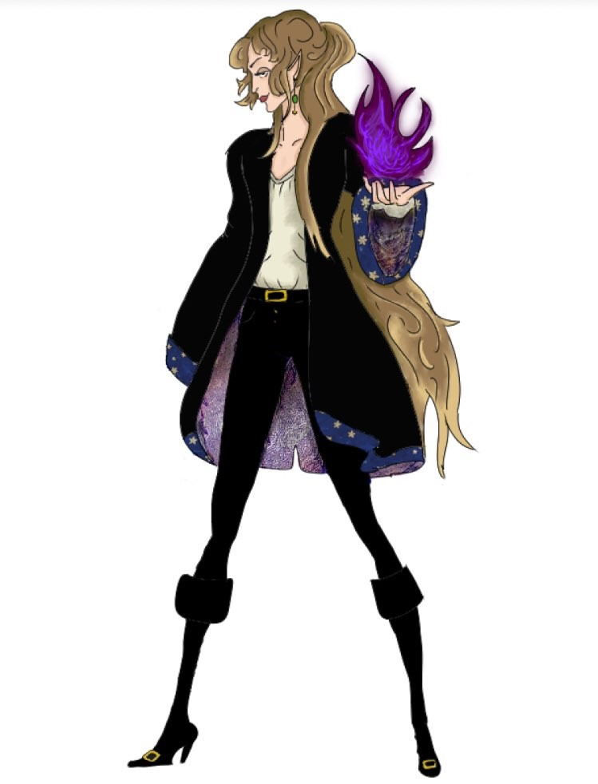
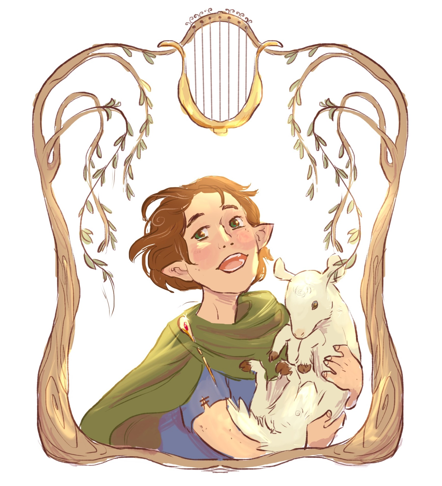
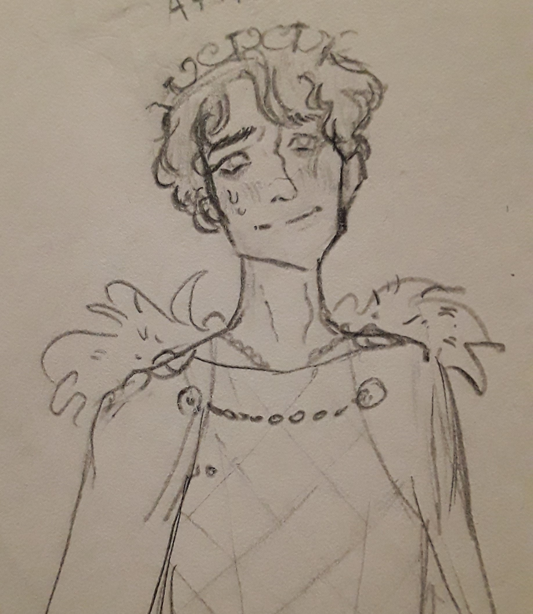
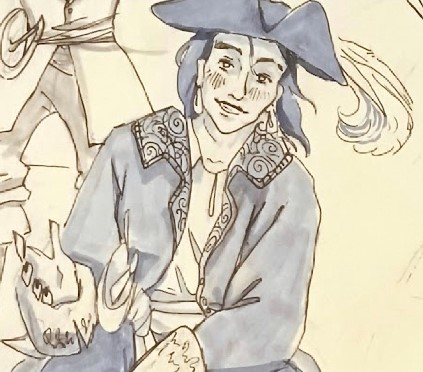

\setlength\parindent{25pt}
```{r setup, include=FALSE}
knitr::opts_chunk$set(echo = FALSE, warning=FALSE)
library(tidyverse)
library(knitr)
library(kableExtra)
```

```{r}
# build a function that creates spell dataframes
spell_creation <- function(cast, range, comp, duration, attack, effect) {
  castc <- c(cast)
  rangec <- c(range)
  compc <- c(comp)
  durationc <- c(duration)
  attackc <- c(attack)
  effectc <- c(effect)
  
  spell <- data.frame(castc, rangec, compc, durationc, attackc, effectc) %>% 
    rename("Casting Time" = castc, "Range/Area" = rangec, "Components" = compc,
           "Duration" = durationc, "Attack/Save" = attackc, "Damage/Effect" = effectc)
  return(spell)
}
```

# Character Sheet

```{r} 
# build the character sheet dataframe and display it
labels <- c("Stat", "Modifier")
STR <- c(10, "+0")
DEX <- c(11, "+0")
CON <- c(8, "-1")
INT <- c(15, "+2")
WIS <- c(13, "+2")
CHA <- c(18, "+4")

charsheet <- data.frame(labels, STR, DEX, CON, INT, WIS, CHA) %>% 
  rename(" " = labels)

kable(charsheet) %>% 
  kable_styling() %>% 
  column_spec(1, bold=T)

```


***

**Hit points**: 42

- Number of hit dice: 6

**Proficiency bonus**: +3

- Double proficiency bonus if performing a CHA check with dragons

**Saving throw proficiencies**: CON, CHA

**Armor class**: 13 without armor (dragon scales)

- Dodge: DEX modifier + armor deflect

A **perception check** is d20 + WIS modifier (WIS check); roll for **initiative** is d20 + DEX modifier (DEX check).

***

## Skills
- Religion [INT]
- Persuasion [CHA]
- Investigation [INT]
- Insight [WIS]

### Languages
- Fluent in Common, Halfling, Draconic languages

### Weapon and tool proficiencies
- Daggers, darts, slings, quarterstaffs, light crossbows
- Navigator's tools, calligrapher's supplies

## Halfling Traits
- **Speed**: 25 feet base walking speed
- **Size**: ~ 3 feet tall, 40 lbs; size Small
- **Lucky**: When you roll a 1 on the d20 for an attack roll, ability check, or saving throw, you can reroll the die and must use the new roll
- **Brave**: Advantage on saving throws against being frightened
- **Halfling Nimbleness**: Can move through the space of any creature that is of a size larger than yours

***

# Spells

**Spell slots**: 1st level [] [] [] []; 2nd level [] [] []; 3rd level [] [] []

***

**Spell save DC**: 8 + Proficiency bonus + CHA modifier

**Spell attack modifier**: Proficiency bonus + CHA modifier

**Sorcerous origin feature - Elemental Affinity**: Starting at 6th level, when you cast a spell that deals damage of the type associated with your draconic ancestry, you can add your Charisma modifier to one damage roll of that spell. At the same time, you can spend 1 sorcery point to gain resistance to that damage type for 1 hour.

**Sorcery points**: 6

* You can transform unexpended sorcery points into one spell slot as a bonus action on your turn. The Creating Spell Slots table shows the cost of creating a spell slot of a given level. You can create spell slots no higher in level than 5th.

* Any spell slot you create with this feature vanishes when you finish a long rest.

* Creating spell slots: 1st-level costs 2pts, 2nd costs 3, 3rd costs 5, 4th costs 6, 5th costs 7

* Converting a Spell Slot to Sorcery Points. As a bonus action on your turn, you can expend one spell slot and gain a number of sorcery points equal to the slot’s level.

## Cantrips {.tabset}

### {-}

### Prestidigitation

```{r}
spell <- spell_creation("1 Action", "10 ft", "V, S", "1 Hour", "None", "Utility")

kable(spell) %>% 
  kable_styling()
```

This spell is a minor magical trick that novice spellcasters use for practice. You create one of the following magical effects within range:

- You create an instantaneous, harmless sensory effect, such as a shower of sparks, a puff of wind, faint musical notes, or an odd odor.
- You instantaneously light or snuff out a candle, a torch, or a small campfire.
- You instantaneously clean or soil an object no larger than 1 cubic foot.
- You chill, warm, or flavor up to 1 cubic foot of nonliving material for 1 hour.
- You make a color, a small mark, or a symbol appear on an object or a surface for 1 hour.
- You create a nonmagical trinket or an illusory image that can fit in your hand and that lasts until the end of your next turn.

If you cast this spell multiple times, you can have up to three of its non-instantaneous effects active at a time, and you can dismiss such an effect as an action.


### Light

```{r}
spell <- spell_creation("1 Action", "Touch (20-ft sphere)", "V, M*", "1 Hour", "DEX Save", "Creation")

kable(spell) %>% 
  kable_styling()
```

You touch one object that is no larger than 10 feet in any dimension. Until the spell ends, the object sheds bright light in a 20-foot radius and dim light for an additional 20 feet. The light can be colored as you like. Completely covering the object with something opaque blocks the light. The spell ends if you cast it again or dismiss it as an action.

If you target an object held or worn by a hostile creature, that creature must succeed on a Dexterity saving throw to avoid the spell.

\* - *a firefly or phosphorescent moss*

### Mold Earth

```{r}
spell <- spell_creation("1 Action", "30 ft (5 ft cube)", "S", "Instantaneous", "None", "Control")

kable(spell) %>% 
  kable_styling()
```

You choose a portion of dirt or stone that you can see within range and that fits within a 5-foot cube. You manipulate it in one of the following ways:

- If you target an area of loose earth, you can instantaneously excavate it, move it along the ground, and deposit it up to 5 feet away. This movement doesn’t have enough force to cause damage.
- You cause shapes, colors, or both to appear on the dirt or stone, spelling out words, creating images, or shaping patterns. The changes last for 1 hour.
- If the dirt or stone you target is on the ground, you cause it to become difficult terrain. Alternatively, you can cause the ground to become normal terrain if it is already difficult terrain. This change lasts for 1 hour.

If you cast this spell multiple times, you can have no more than two of its non-instantaneous effects active at a time, and you can dismiss such an effect as an action.


### Acid Splash

```{r}
spell <- spell_creation("1 Action", "60 ft", "V, S", "Instantaneous", "DEX Save", "Acid")

kable(spell) %>% 
  kable_styling()
```

You hurl a bubble of acid. Choose one or two creatures you can see within range. If you choose two, they must be within 5 feet of each other. A target must succeed on a Dexterity saving throw or take 1d6 acid damage.

This spell’s damage increases by 1d6 when you reach 5th level (2d6), 11th level (3d6), and 17th level (4d6).

### Poison Spray

```{r}
spell <- spell_creation("1 Action", "10 ft", "V, S", "Instantaneous", "CON Save", "Poison")

kable(spell) %>% 
  kable_styling()
```

You extend your hand toward a creature you can see within range and project a puff of noxious gas from your palm. The creature must succeed on a Constitution saving throw or take 1d12 poison damage.

This spell's damage increases by 1d12 when you reach 5th level (2d12), 11th level (3d12), and 17th level (4d12).


## Level 1 {.tabset}

### {-}

### Mage Armor

```{r}
spell <- spell_creation("1 Action", "Touch", "V, S, M*", "8 Hours", "None", "Buff")

kable(spell) %>% 
  kable_styling()
```

You touch a willing creature who isn't wearing armor, and a protective magical force surrounds it until the spell ends. The target's base AC becomes 13 + its Dexterity modifier. The spell ends if the target dons armor or if you dismiss the spell as an action.

\* - *a piece of cured leather*

### Thunderwave


```{r}
spell <- spell_creation("1 Action", "Self (15 ft cube)", "V, S", "Instantaneous", "CON Save", "Thunder")

kable(spell) %>% 
  kable_styling()
```

A wave of thunderous force sweeps out from you. Each creature in a 15-foot cube originating from you must make a Constitution saving throw. On a failed save, a creature takes 2d8 thunder damage and is pushed 10 feet away from you. On a successful save, the creature takes half as much damage and isn't pushed.

In addition, unsecured objects that are completely within the area of effect are automatically pushed 10 feet away from you by the spell's effect, and the spell emits a thunderous boom audible out to 300 feet.

**At Higher Levels**. When you cast this spell using a spell slot of 2nd level or higher, the damage increases by 1d8 for each slot level above 1st.

### Charm Person

```{r}
spell <- spell_creation("1 Action", "30 ft", "V, S", "1 Hour", "WIS Save", "Charmed")

kable(spell) %>% 
  kable_styling()
```

You attempt to charm a humanoid you can see within range. It must make a Wisdom saving throw, and does so with advantage if you or your companions are fighting it. If it fails the saving throw, it is charmed by you until the spell ends or until you or your companions do anything harmful to it. The charmed creature regards you as a friendly acquaintance. When the spell ends, the creature knows it was charmed by you.

**At Higher Levels**. When you cast this spell using a spell slot of 2nd level or higher, you can target one additional creature for each slot level above 1st. The creatures must be within 30 feet of each other when you target them.

## Level 2 {.tabset}

### {-}

### Scorching Ray

```{r}
spell <- spell_creation("1 Action", "120 ft", "V, S", "Instantaneous", "Ranged", "Fire")

kable(spell) %>% 
  kable_styling()
```

You create three rays of fire and hurl them at targets within range. You can hurl them at one target or several.

Make a ranged spell attack for each ray. On a hit, the target takes 2d6 fire damage.

**At Higher Levels**. When you cast this spell using a spell slot of 3rd level or higher, you create one additional ray for each slot level above 2nd.

### Detect Thoughts

```{r}
spell <- spell_creation("1 Action", "Self", "V, S, M*", "1 Minute", "WIS Save", "Detection")

kable(spell) %>% 
  kable_styling()
```

For the duration, you can read the thoughts of certain creatures. When you cast the spell and as your action on each turn until the spell ends, you can focus your mind on any one creature that you can see within 30 feet of you. If the creature you choose has an Intelligence of 3 or lower or doesn’t speak any language, the creature is unaffected.

You initially learn the surface thoughts of the creature—what is most on its mind in that moment. As an action, you can either shift your attention to another creature’s thoughts or attempt to probe deeper into the same creature’s mind. If you probe deeper, the target must make a Wisdom saving throw. If it fails, you gain insight into its reasoning (if any), its emotional state, and something that looms large in its mind (such as something it worries over, loves, or hates). If it succeeds, the spell ends. Either way, the target knows that you are probing into its mind, and unless you shift your attention to another creature’s thoughts, the creature can use its action on its turn to make an Intelligence check contested by your Intelligence check; if it succeeds, the spell ends.

Questions verbally directed at the target creature naturally shape the course of its thoughts, so this spell is particularly effective as part of an interrogation.

You can also use this spell to detect the presence of thinking creatures you can’t see. When you cast the spell or as your action during the duration, you can search for thoughts within 30 feet of you. The spell can penetrate barriers, but 2 feet of rock, 2 inches of any metal other than lead, or a thin sheet of lead blocks you. You can’t detect a creature with an Intelligence of 3 or lower or one that doesn’t speak any language.

Once you detect the presence of a creature in this way, you can read its thoughts for the rest of the duration as described above, even if you can’t see it, but it must still be within range.

\* - *a copper piece*

## Level 3 {.tabset}

### {-}

### Erupting Earth

```{r}
spell <- spell_creation("1 Action", "120 ft (20 ft cube)", "V, S, M*", "Instantaneous", "DEX Save", "Bludgeoning")

kable(spell) %>% 
  kable_styling()
```

Choose a point you can see on the ground within range. A fountain of churned earth and stone erupts in a 20-foot cube centered on that point. Each creature in that area must make a Dexterity saving throw. A creature takes 3d12 bludgeoning damage on a failed save, or half as much damage on a successful one. Additionally, the ground in that area becomes difficult terrain until cleared. Each 5-foot-square portion of the area requires at least 1 minute to clear by hand.

**At Higher Levels**. When you cast this spell using a spell slot of 4th level or higher, the damage increases by 1d12 for each slot level above 3rd.

\* - *a piece of obsidian*

### Dispel Magic
```{r}
spell <- spell_creation("1 Action", "120 ft", "V, S", "Instantaneous", "None", "Control")

kable(spell) %>% 
  kable_styling()
```

Choose one creature, object, or magical effect within range. Any spell of 3rd level or lower on the target ends. For each spell of 4th level or higher on the target, make an ability check using your spellcasting ability. The DC equals 10 + the spell's level. On a successful check, the spell ends.

**At Higher Levels**. When you cast this spell using a spell slot of 4th level or higher, you automatically end the effects of a spell on the target if the spell's level is equal to or less than the level of the spell slot you used.

***

## Metamagic

You can use only one Metamagic option on a spell when you cast it, unless otherwise noted.

### Careful Spell

When you cast a spell that forces other creatures to make a saving throw, you can protect some of those creatures from the spell’s full force. To do so, you spend 1 sorcery point and choose a number of those creatures up to your CHA modifier (minimum of one creature). A chosen creature automatically succeeds on its saving throw against the spell.

### Distant Spell

When you cast a spell that has a range of 5 feet or greater, you can spend 1 sorcery point to double the range of the spell.

When you cast a spell that has a range of touch, you can spend 1 sorcery point to make the range of the spell 30 feet.


# Current Equipment

### Weapons

- Longbow from Quill (5/8/21)
- 2 bronze daggers (unoxidized)
- Arcane focus and weapon: bronze quarterstaff, partially oxidized (1d6; versatile 1d8, aka if 2 hand attack)

### Travel

- explorer’s pack:
    + duffel bag
    + bedroll
    + mess kit
    + tinderbox
    + 10 torches
    + 10 days rations
    + waterskin
    + 50 ft hempen rope

#### Food/Medicine

- 10 new bread rolls
- Huge bottle of fantasy tropicana orange juice
- little bottle of painkiller elixir

### Personal

- trinket: shard of obsidian that’s always warm
- last letter sent from Astera, a month before I returned and she was gone
- book keeping receipts of jobs done in the past
- spare set of common clothes (similar design to current)
- pouch containing 239 gold pieces + 95 copper pieces

***

# Background

{height=4in}

**Race**: [Halfling](https://www.dndbeyond.com/races/halfling)

**Class**: [Sorceror](https://www.dndbeyond.com/classes/sorcerer) (copper draconic bloodline, acidic)

Milo is a 24-year old halfling from **Three Peppers**, a small community in southeast Tarrin that specialized in soybean and rice production. He was the first one in town to show signs of a draconic bloodline in many years. As a copper dragon-based sorceror (acid), his powers were not particularly helpful to the town, so he was mostly left alone; the area has a history of draconic-lineage sorcerors, and there was little discrimination.

Milo grew up working on the farm, attending the local village school, and picking up the basics of self defense with a **quarterstaff**, which she now carries. As she got older, she developed an interest in her family history; she spent a lot of time digging through old books and diaries in the attic, and the local library, trying to figure out her draconic heritage. Her younger sister, Astera, was a precocious kid and would often accompany her up to the attic, sharing roast beef sandwiches in the dusty space.

Astera herself also displayed some dragon scaling, but as it wasn't the distinctive markers of "useful" powers (such as fire/cold control), she too was left alone. She was more interested in the artifacts in the attic; she discovered a **trinket**, a shard of obsidian that's always warm, which gave Milo very bad vibes but which she kept.

When Astera was 15, Milo 19, the villagers found her experimenting with her magic in the fields, realizing that her green scale pattern indicated poison-based powers, and that she had poisoned several fields of crops. It's questionable whether or not this was intentional on her part. Regardless, they demanded she be banished, at least until she learned to control her powers, so Milo took her to a sorcerors' boarding school in Wellspring, called **The Sanshi School of Sorcerors**, with headmistress **Ban Zhao (Venerable Madame Cao)**. Before Milo left, she gave them the obsidian to keep safe.

Milo signed a five-year contract with the **East India Long Haul Trucker Group, Inc.**, looking to make some money to put her through boarding school and support their parents back at home. He visits her at school several times, and she seems to be flourishing. While on his contract, Milo befriended several people across different towns.

Three years after Astera started boarding school, Milo went to visit her, as they were between gigs, and discovered that the entire school had disappeared. There was a new building in a more modern architectural style where the school had been, and upon questioning locals and local authorities, no one else could remember the school.

Milo decides that their parents *cannot* know what has happened to Astera (while she was ostensibly under his watch) and embarks on a journey to collect more information about Astera's school's disappearance, worried and distraught. He tells their parents that she is doing well at school but can't visit home because of her busy curriculum. Milo feels guilty, both for losing Astera and for misleading their parents, but worries that the shock will do great damage against their failing health.

She spends a month searching for any leads, and finds nothing. She returns to her job and continues asking around in the towns the job takes her; she still has two contracted years to finish.

The campaign starts near the end of Milo's contract, when she's 24. She has not found any real leads yet.

## Relationships {.tabset}

### Rose (Oracle)

{height=3in}

```{r}
r1 <- c("Age", "Race", "Class", "Role", "Status")
r2 <- c("16", "Elf", "Cleric", "High Priestess (Oracle)", "Friend")
kable(data.frame(r1, r2), col.names=NULL) %>% 
  kable_styling() %>% 
  column_spec(1, bold=T)
```

Milo's person-to-be-escorted/bodyguarded. Milo trusts her, does not think she has ill intent, but does think she is beholden to higher powers that may have ill intent. Thinks her crush on Atticus is funny, and teases her about it.

### Thunder

{height=3in}

```{r}
r1 <- c("Age", "Race", "Class", "Role", "Status")
r2 <- c("12 (adult)", "Kenku", "Fighter of some sort?", "Bodyguard", "Friend")
kable(data.frame(r1, r2), col.names=NULL) %>% 
  kable_styling() %>% 
  column_spec(1, bold=T)
```

Good fellow. Doesn't talk much, but would definitely have Milo's back.

### Ukirian Isildir

{height=3in}

```{r}
r1 <- c("Age", "Race", "Class", "Role", "Status")
r2 <- c("Dad", "Elf", "??? Has a demon. Sucks blood", "Bodyguard", "Colleague")
kable(data.frame(r1, r2), col.names=NULL) %>% 
  kable_styling() %>% 
  column_spec(1, bold=T)
```

Milo trusts Ukirian to have his back, mostly, but there is something secret Ukirian is holding back. Like, he would have Milo's back, unless something came up, and what is the something?

Also the whole incident with the very weird stabbing situation. Something was off there.

### Geehee Smoolar

{height=3in}

```{r}
r1 <- c("Age", "Race", "Class", "Role", "Status")
r2 <- c("20", "Dwarf? Halfling? Lil guy", "Bard (?)", "Bodyguard", "Friend")
kable(data.frame(r1, r2), col.names=NULL) %>% 
  kable_styling() %>% 
  column_spec(1, bold=T)
```

He's just a little guy. Milo thinks he's a little too trusting but likes having him around.

**Furgle**: Beloved goat. Eats Milo's bread rolls.

### Atticus

{height=3in}

```{r}
r1 <- c("Age", "Race", "Class", "Role", "Status")
r2 <- c("17", "Teen boy", "??", "King of the Southern Isles", "Higher-up")
kable(data.frame(r1, r2), col.names=NULL) %>% 
  kable_styling() %>% 
  column_spec(1, bold=T)
```

King of the Southern Isles, on the verge of being ousted? Like 17 years old. Dude, someone get this guy a non-evil vizier so he can catch a break. Milo trusts him as a person but not necessarily as a king. Thinks his crush on Rose is funny, but is too intimidated by his status to tease him about it.

### Others

**Astera Rainleaf**

Milo's younger sister. Loving relationship, though she's been missing for almost two years. Presumed alive, based on Leaf's intel.

***

**Leaf (Astera's acquaintance)**

Gnome. Charm Person'ed him once while he was trying to attack us, or Atticus, or something. He knows something about Astera but questioning was mostly futile, except the confirmation that she was out there somewhat recently, still kicking. Question him further.

***

**Queen Blanche**

Go off girl! Milo thinks she is the most adept (of the available options) to be the next high ruler or whatever. Committed voter fraud in her name.

***

**Captain Thorne**

{height=2in}

Hot.

***

**Literally any of the Oracle's ~~keepers~~ priests/priestesses**

THOSE GUYS SUCK! Well Orym can have a pass. I guess.

***

**Anarchy (inn/stable keeper)**

Inn/stable owner in Queenstown; a strong believer in anarchy, wiry and witty, I've stopped at their place for rest stops.

The campaign stopped here when visiting Queenstown.

***

**Serena (tavern owner)**

Tavern owner in Leeside, big-boned woman who makes killer shepherd’s pie and will freely discuss history/culture over a meal.

***

**Peder (store owner)**

Store owner on outskirts of Sonis, brusquely efficient, good prices for quality goods, did him a favor delivering something for free once so he owes me a small favor.
